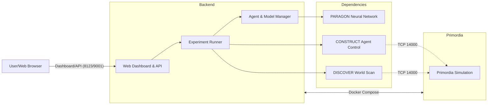

# bampro

**Biofoundry And MARL Paragon Repo Orchestrator**

This project leverages Docker Compose to orchestrate the **Primordia simulation** alongside a custom AI backend for distributed multi-agent reinforcement learning (MARL) experiments.

## Mermaid source code



## GIT CLONE

```
git clone --recurse-submodules https://github.com/OpenFluke/bampro
```

## Setup biofoundry

```
cd primordia/
./download_biofoundry.sh
```

## Setup Docker

Run the following to install Docker and Docker Compose:

```bash
chmod +x install_docker.sh
```

```bash
sudo ./install_docker.sh
```

## 📁 Project Structure

```

bampro/
├── docker-compose.yaml # Docker Compose orchestration file
├── LICENSE # Project license
├── primordia/ # Primordia simulation/game engine
├── README.md # This file
├── thinking/ # Supporting AI logic, neural networks, or Paragon components

```

- **primordia/**: Hosts the simulation engine for running experiments.
- **thinking/**: Includes additional AI components, such as neural networks or MARL algorithms.

## 🚀 Quick Start

To get started, run the following commands in the project root:

```sh
# Stop any running containers
docker-compose down

# Rebuild all images without cache
docker-compose build --no-cache

# Start all services and force recreate containers
docker-compose up --force-recreate
```

or

```
docker compose up
```

## 🖧 Communication

- Services communicate over the Docker Compose network.
- Use **service names** as hostnames (e.g., `primordia:14000`) for connections between the backend and simulation.

## 📝 Useful Commands

- **View logs for a specific service:**

  ```sh
  docker-compose logs primordia
  ```

  Replace with the actual service names defined in `docker-compose.yaml`.

- **Stop all containers:**

  ```sh
  docker-compose down
  ```

- **Clean up stopped containers, networks, and images (optional):**

  ```sh
  docker system prune -af
  ```

## ⚡️ Tips

- Modify ports or add services by editing `docker-compose.yaml`.
- Always use **Docker service names** instead of `localhost` for inter-container communication.
- To run commands without `sudo`, ensure your user is added to the `docker` group:

  ```sh
  sudo usermod -aG docker $USER
  ```

## Running Biofoundry Manually

To run Biofoundry in headless mode with specific port and worker configurations, use the following command:

```bash
cd primordia/biofoundry
./BioFoundry.x86_64 --headless -headless -UDPPort=15000 -TCPPort=16000 -TCPWorkers=14000
```
