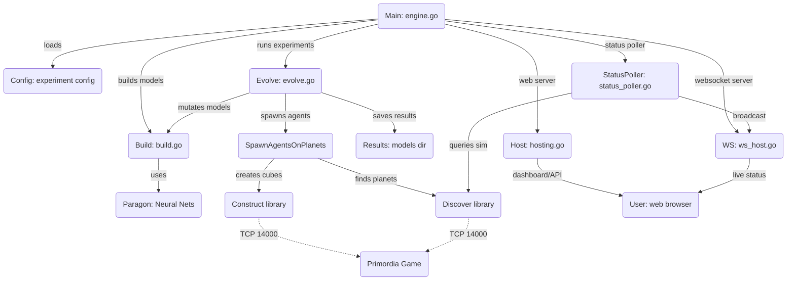

# Bampro Thinking Module

The `thinking` module in the [Bampro project](https://github.com/OpenFluke/bampro) is a core component designed to simulate and evolve neural network-based agents in a 3D environment. It leverages the `PARAGON` library for neural network operations and the `D.I.S.C.O.V.E.R.` library for scene management, enabling agents to navigate and interact with virtual planets. The module supports multiple numerical types (e.g., `float32`, `int`, etc.) and experiment modes (Standard, Replay, DynamicReplay) to evaluate agent performance across various configurations.

## Mermaid source code



## Table of Contents

- [Overview](#overview)
- [Features](#features)
- [Project Structure](#project-structure)
- [Dependencies](#dependencies)
- [Installation](#installation)
- [Usage](#usage)
- [Configuration](#configuration)
- [Contributing](#contributing)
- [License](#license)

## Overview

The `thinking` module implements an evolutionary algorithm to train and evaluate neural network agents. Agents are spawned on virtual planets, where they process inputs, make decisions, and move toward goals. The system supports:

- Neural network construction and mutation for various numerical types.
- Agent lifecycle management (spawning, running, despawning).
- Performance evaluation and result aggregation.
- Web-based monitoring via a Fiber server and WebSocket updates.

The module is part of the broader Bampro project, which aims to explore AI-driven simulations in complex environments.

## Features

- **Multi-Type Neural Networks**: Supports `int`, `int8`, `float32`, `float64`, and other numerical types for neural network operations.
- **Experiment Modes**:
  - **Standard**: Basic neural network operation.
  - **Replay**: Replays previous layer outputs for enhanced learning.
  - **DynamicReplay**: Dynamically adjusts replay based on performance.
- **Agent Simulation**: Agents navigate 3D space with configurable movement and lifespan.
- **Evolutionary Training**: Generates and evaluates mutated network variants across generations.
- **Web Interface**: Real-time monitoring of experiment status and scores via a dashboard.
- **Scene Integration**: Uses `D.I.S.C.O.V.E.R.` for planet and cube (agent) management.
- **Benchmarking**: Evaluates performance for different numerical types with CPU usage tracking.

## Project Structure

The `thinking` folder contains the following key files:

- **`agent.go`**: Defines the `Agent` struct and logic for running agents, including neural network forward passes and position updates.
- **`build.go`**: Handles neural network construction for different numerical types and modes, with model saving functionality.
- **`engine.go`**: Main entry point, initializes the experiment, and manages WebSocket and status polling.
- **`evolve.go`**: Implements the evolutionary loop, variant generation, agent spawning, and result aggregation.
- **`experiment.go`**: Sets up initial models and runs benchmarks for performance evaluation.
- **`experiment_config.go`**: Defines the `ExperimentConfig` struct and loads configuration from JSON.
- **`helper.go`**: Utility functions for statistics (mean, median, etc.) and distance calculations.
- **`hosting.go`**: Sets up the Fiber web server for the dashboard and static file serving.
- **`messaging.go`**: Defines WebSocket message types and serialization.
- **`status.go`**: Manages experiment status updates for real-time monitoring.
- **`status_poller.go`**: Periodically scans the game environment and broadcasts status updates.
- **`test.go`**: Tests TCP connectivity to the game server.
- **`web_reference.go`**: Utility for finding bundled JavaScript/CSS files.
- **`ws_host.go`**: Manages WebSocket connections and broadcasts experiment data.

## Dependencies

- **Go**: Version 1.18 or higher (for generics support).
- **External Libraries**:
  - `github.com/OpenFluke/PARAGON`: Neural network library.
  - `github.com/OpenFluke/discover`: Scene and environment management.
  - `github.com/OpenFluke/construct`: Cube (agent) management.
  - `github.com/gofiber/fiber/v2`: Web server framework.
  - `github.com/gofiber/websocket/v2`: WebSocket support.
  - `github.com/shirou/gopsutil/v3`: CPU usage monitoring.
  - `github.com/joho/godotenv`: Environment variable loading.
- **Game Server**: A running instance of the Primordia server (default: `localhost:14000`).

## Installation

1. **Clone the Repository**:

   ```bash
   git clone --recurse-submodules https://github.com/OpenFluke/bampro
   cd bampro/thinking
   ```

2. **Install Go**:
   Ensure Go 1.18+ is installed. Download from [golang.org](https://golang.org/dl/).

3. **Install Dependencies**:

   ```bash
   go mod tidy
   ```

4. **Set Up Environment Variables**:
   Create a `.env` file in the `thinking` directory:

   ```env
   GAME_HOST=localhost
   GAME_PORT=14000
   EXPERIMENT_PASSWORD=letmein
   PORT=8123
   ```

   Adjust values as needed for your setup.

5. **Start the Game Server**:
   Ensure the Primordia server is running and accessible at the specified `GAME_HOST` and `GAME_PORT`.

## Usage

1. **Configure the Experiment**:
   Create or modify `experiment_config.json` in the `thinking` directory. See [Configuration](#configuration) for details.

2. **Run the Application**:

   ```bash
   go run .
   ```

3. **Access the Dashboard**:
   Open a browser and navigate to `http://localhost:8123/dashboard` to monitor experiment progress.

4. **Monitor Output**:

   - Console logs show agent activity, model generation, and errors.
   - Results are saved in the `models/` directory, organized by generation.
   - WebSocket updates (`ws://localhost:9001/ws/status`) provide real-time status and scores.

5. **Stop the Application**:
   Press `Ctrl+C` to stop the server and agent simulations.

## Configuration

The `experiment_config.json` file defines the experiment parameters. Key fields include:

- **`name`**: Experiment name (e.g., "Bampro Thinking").
- **`numerical_types`**: List of numerical types (e.g., `["float32", "float64", "int"]`).
- **`modes`**: Experiment modes (e.g., `["Standard", "Replay", "DynamicReplay"]`).
- **`planets`**: List of planet coordinates (e.g., `["(0,0,0)", "(1,0,0)"]`).
- **`episodes`**: Number of generations to run.
- **`spectrum_steps`**: Number of mutated variants per generation.
- **`spectrum_max_stddev`**: Maximum standard deviation for weight mutations.
- **`network_config`**: Neural network layer definitions (width, height, activation).
- **`movement`**: Agent movement settings (clamp, actions per second, lifespan).
- **`evaluation_spawns_per_planet`**: Number of agents spawned per planet.
- **`auto_launch`**: Automatically start the experiment on load.
- **`load_balance`**: Enable performance benchmarking.

Example:

```json
{
  "name": "Bampro Thinking",
  "numerical_types": ["float32", "float64"],
  "modes": ["Standard", "Replay"],
  "planets": ["(0,0,0)", "(1,0,0)"],
  "episodes": 10,
  "spectrum_steps": 5,
  "spectrum_max_stddev": 0.1,
  "network_config": {
    "layers": [
      { "width": 6, "height": 1, "activation": "linear" },
      { "width": 128, "height": 1, "activation": "relu" },
      { "width": 128, "height": 1, "activation": "relu" },
      { "width": 3, "height": 1, "activation": "tanh" }
    ]
  },
  "movement": {
    "translation": {
      "clamp": { "x": 1.0, "y": 1.0, "z": 1.0 },
      "actions_per_second": 10
    },
    "rotation": {
      "clamp": { "x": 0.0, "y": 0.0, "z": 0.0 },
      "actions_per_second": 0
    },
    "max_lifespan_seconds": 60
  },
  "evaluation_spawns_per_planet": 8,
  "auto_launch": true,
  "load_balance": true
}
```
